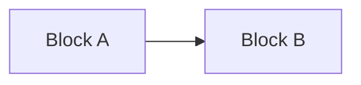
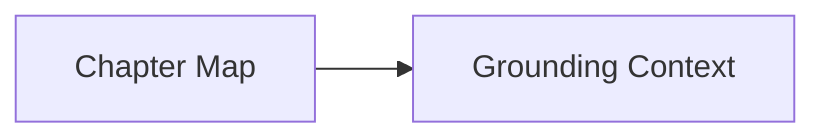
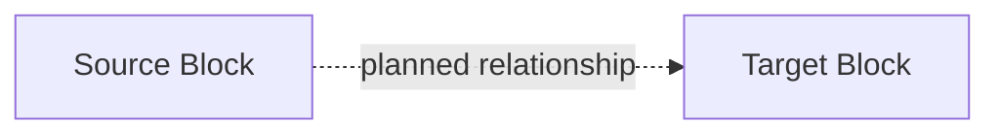
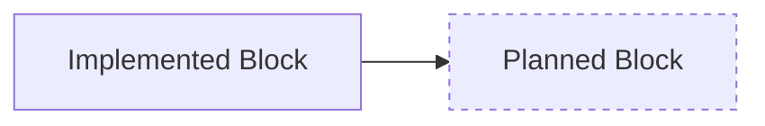

# Building Mental Maps

Maintain a senior-engineer mental map in Obsidian after completed issue, PR, or
commit work. The map preserves the project's current logical shape using
layered Mermaid diagrams and tiny wikilinked block notes.

Write only to the Obsidian vault. Read repo docs and diffs as evidence, but do
not maintain a parallel repo atlas.

## Required Inputs

Require these before editing:

- Obsidian vault path.
- Project atlas note name, or permission to create `<Project Name> Atlas.md`.
- Issue numbers, PR URL, commit range, or explicit diff range to map.

If the vault path is missing, ask. Do not guess it from the repo.

## Workflow

1. Identify the target issue, PR, commit range, or diff range.
   Done when the requested change set is unambiguous.

2. Read the atlas note, index note, and touched block notes.
   Done when current layers, block names, and `Connects` claims are known.

3. Read relevant project context docs when present: `CONTEXT.md`,
   `docs/architecture.md`, `docs/architecture-diagrams.md`,
   `docs/ubiquitous-language.md`, ADRs, PRDs, or issue notes. Do not copy them
   into Obsidian. Done when vocabulary and decisions are grounded.

4. Read the PR or commit diff once. Start with stats and changed-file list, then
   inspect relevant hunks. Open full files only when the diff is ambiguous.
   Done when you have a temporary 3-6 bullet delta in plain English.

5. Decide the mental-map change:
   - create a block,
   - update a block,
   - link blocks,
   - rename a block,
   - deprecate a block,
   - delete a block,
   - or make no atlas change.
   Done when every supplied change is accounted for by current project shape,
   not by a changelog.

6. Reconcile relationships before editing:
   - For every touched block-note `Connects` item, choose `atlas edge`,
     `planned atlas edge`, or `note-only`.
   - Do not silently omit a claimed relationship.
   - If a diagram edge is not represented in either source or target notes,
     add the note relationship or remove the edge.
   Done when notes and diagrams have an intentional relationship set.

7. Edit only the atlas note, index note, and touched block notes.
   Done when verification passes or skipped checks are named.

## Obsidian Shape

Use ordinary Markdown files in the vault. Obsidian does not need to be running.
Do not require Canvas, Bases, URI automation, REST plugins, or paid services.

Use:

- One atlas note: `<Project Name> Atlas.md`.
- One index note: `<Project Name> Blocks Index.md`.
- One Markdown note per block.
- Normal `[[wikilinks]]` in block notes and the index. Mermaid links alone do
  not create a useful Obsidian graph/backlink structure.
- Plain note-title labels plus Obsidian's Mermaid `internal-link` class in
  atlas diagrams. Do not put `[[wikilinks]]` inside Mermaid node labels.

## Atlas Note

The atlas note is visual and terse. Each layer must answer one question in its
heading, not merely name an area.

````md
# Project Name Atlas

## Overview: How Do The Major Blocks Fit?



## Layer: How Does Context Reach Generation?



## Open Questions

- Only questions that affect the mental map.
````

Rules:

- Use Mermaid `flowchart LR` only.
- Use plain note titles as Mermaid node labels and apply `class <node>
  internal-link` so nodes open matching Obsidian notes.
- Keep each diagram to about 12 blocks. Split larger diagrams into another
  layer.
- Use directed arrows. Label non-obvious implemented edges.
- Use dashed arrows for planned relationships:



- Use dashed styling for planned blocks:



## Block Notes

A block is a remembered implementation responsibility, not a file, class, or
feature label. Name blocks with senior-engineer-friendly responsibility names
that stay true to the underlying codebase.

Every block note uses this shape:

```md
---
type: mental-map-block
project: Project Name
status: implemented
---

# Block Name

Purpose: One sentence.

Concrete anchors:
- `module.or.interface`
- `ImportantModel`
- `important_route_or_function`

Connects:
- [[Other Block]] -> relationship label

Evidence: [#123](https://github.com/org/repo/issues/123)
```

Rules:

- `status` is only `implemented` or `planned`.
- Implemented blocks must have concrete anchors verified in the current
  codebase by search or direct file reads.
- Planned blocks may omit concrete anchors, but must have issue, PRD, ADR, or
  architecture evidence.
- Keep `Purpose`, `Hides`, and `Open question` to one sentence each.
- Prefer updating an existing block when an issue changes an existing
  responsibility.
- Create a new block only when the change introduces a stable responsibility a
  senior engineer will need to remember later.
- Deprecate instead of deleting when unsure.
- Rename when the old name no longer matches the responsibility; update atlas
  links, index links, and touched block-note links.

## Index Note

The index note is only navigation:

```md
# Project Name Blocks Index

- [[Block A]]
- [[Block B]]
- [[Block C]]
```

Do not duplicate block summaries in the index.

## Batch Mode

When invoked after multiple issues or PRs:

1. Produce one temporary delta per issue/PR/commit.
2. Merge those deltas into one coherent atlas update.
3. Update the map to show what the project looks like now, not the order of
   implementation.

Do not commit temporary deltas into Obsidian.

## Optional GitNexus Branch

If GitNexus is available and the diff is hard to explain, use it only to
understand the temporary delta. Do not copy GitNexus flow output into the atlas.
Convert findings into logical blocks and concrete anchors.

## Verification

Before finishing, check:

- The atlas note exists.
- The index note exists.
- Every atlas diagram uses `flowchart LR`.
- Every atlas layer heading states the question the layer answers.
- Every diagram has about 12 blocks or fewer.
- Every Mermaid node label names a corresponding block note or one intentionally
  created in this pass.
- Every Mermaid node is assigned the `internal-link` class.
- Every implemented block has verified `Concrete anchors`.
- Every planned block has evidence.
- Every touched block-note `Connects` item is intentionally represented as an
  atlas edge, planned atlas edge, or note-only relationship.
- Every atlas edge is backed by source/target block-note `Connects` text.
- The index includes every created or touched block note.
- No temporary issue-delta bullets were written into Obsidian.

In the final response, report changed notes, created blocks, renamed blocks,
deprecated blocks, and verification status.
