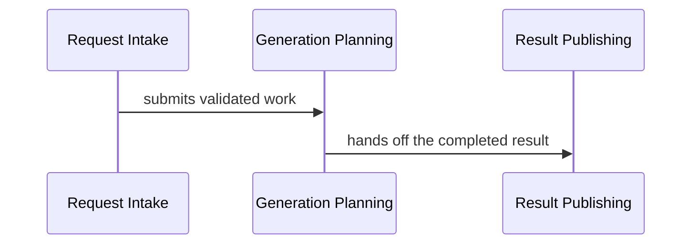

# Native Obsidian views

Use this reference when creating a full atlas or when a sync changes blocks,
relationships, hierarchy, journeys, or projections.

The native stack has one model and several views:

- Markdown notes, Properties, and wikilinks hold facts.
- Canvas explains spatial structure and provides progressive zoom.
- Bases filters the block catalog.
- Mermaid explains precise dynamic flows.
- Local Graph supports ad hoc neighborhood exploration.

## Contents

- [Required version 2 views](#required-version-2-views)
- [Orientation paths](#orientation-paths)
- [Canvas contract](#canvas-contract)
- [Base contract](#base-contract)
- [Dynamic flow contract](#dynamic-flow-contract)
- [Change-impact paths](#change-impact-paths)
- [Reading experience](#reading-experience)
- [Visual verification](#visual-verification)

## Required version 2 views

Create:

1. `<Project> Atlas.canvas` — the compact visual front door.
2. `<Project> Blocks.base` — the exhaustive block catalog.
3. A short `<Project> Atlas.md` — purpose, reading order, revision, coverage
   summary, unresolved questions, and ordinary links to every entry view.
4. `Views/<Project> All Relationships.canvas` — the separately laid-out
   exhaustive projection of every implemented relationship.
5. One focused `journey` or `contract` note for each entry-point inventory row,
   unless that row records a specific valid no-view reason.
6. Scoped Canvas drill-downs when one top-level area cannot remain legible.

Record the exhaustive Canvas as
`relationships-canvas: Views/<Project> All Relationships.canvas` in atlas
frontmatter and link it from the atlas note. Keep it even when the relationship
graph is dense. Preserve the atlas's semantic groups, use generous spacing and
stable lanes, and add focused Mermaid or scoped views for readable slices.

Add runtime, data/state, cross-cutting, or code-level views only when they answer
a concrete architectural question.

Link every scoped Canvas and Markdown journey directly from the atlas so the
validator can discover it. Wikilinks are vault-relative, while artifact paths
in atlas frontmatter are map-relative. Prefer exact vault-relative,
path-qualified wikilinks so each target resolves to one artifact rather than
depending on Obsidian's link suggestion order.

## Orientation paths

After satisfying the entry-point inventory row by row, use the smallest set of
other entry views that lets a reader move from intent to change without opening
source:

| Reader question | Canonical facts | Preferred view |
| --- | --- | --- |
| Why does the system exist and what is outside it? | atlas purpose/domain, actors, external systems | atlas Canvas context cluster |
| Who owns each promise and dependency? | `Provides`, `Requires`, `Connects` | responsibility Canvas or compact flowchart |
| What state must remain valid? | state owners and invariants | state/data view; Mermaid only when transitions matter |
| How does work succeed or fail? | runtime behavior and relationships | focused success/failure sequence notes |
| Where does it run and fail independently? | deployment fields, runtimes, stores | deployment Canvas |
| Which policies and decisions constrain it? | policies, evidence, quality and risks | cross-cutting Canvas or short decision/risk section |
| What changes if this contract or rule changes? | interfaces, relationships, state, policies, anchors | scoped change-impact path |

Do not create every reader-question row mechanically. Combine those questions
when one legible view answers them at the same abstraction level; add a view
when the answer would otherwise require source inspection or guesswork. This
does not permit combining distinct entry-point inventory families into one
broad journey: each inventory row needs its own focused view or no-view reason.

The Base is a catalog and navigation surface. It does not satisfy the rule that
each active block appear in at least one architecture projection; use a Canvas
or Mermaid view for that.

For a static library or other entry-point family with no meaningful ordered
flow, use a focused `contract` ownership/data-movement view and canonical
`Provides`, `Requires`, and consumer links. Use a no-view reason only when those
canonical contracts stand alone without a useful projection.

## Canvas contract

Show the smallest coherent set of blocks that orients a reader at the Canvas's
chosen abstraction level. Prefer context, runtimes, stores, external systems,
and top-level responsibilities. Every implemented root, context, and runtime
block is an orientation block and must appear on the main Canvas; a Mermaid or
scoped view cannot replace it. Do not add, omit, merge, or split blocks to hit a
numeric card quota. Put deeper child responsibilities in scoped views and ensure
every active block still appears in at least one relevant projection.

Declare semantic grouping in the atlas's required `## Canvas semantic groups`
table defined by [MAP-MODEL.md](MAP-MODEL.md#canvas-semantic-group-contract).
Group by runtime, control boundary, lifecycle, or another coherent domain—not
by screen position or arbitrary row. The row's question must explain the
cohesion. Render every declaration as the exact stable group node in both
required Canvases, put it behind its cards, fully contain those cards, and keep
groups disjoint. Every compact card belongs directly to exactly one group; a
deeper card in the all-relationships Canvas inherits the group of its nearest
declared ancestor.

Keep only the canonical orientation relationships a reader needs to understand
the dominant structure as a sparse backbone. Every implemented compact card
must participate in that backbone, and collapsing implemented cards into their
declared groups must leave one weakly connected group graph. A clearly labelled
planned-only group may preview planned cards without inventing current Canvas
edges. Any other isolated card is a modeling signal: connect it with a real
orientation relationship or move non-orienting detail to a scoped view. Never
make a file-by-file Canvas and never add or remove relationships to meet a
numeric edge quota. The contract constrains topology, not counts.

Use file-backed cards for canonical notes. Narrow every generated block card to
its exact H1 with `subpath: "#Block Name"`; whole-note cards expose the inline
title and Properties editor, which consume the card face and prevent a native
drag from starting there after the card is focused. The H1-scoped body remains
draggable in normal mode; after editing the embedded note, press `Escape` or
click outside before dragging. Text cards may supply a short legend or
orientation but never the only copy of substantive knowledge. Use directed
edges only for relationships present in source block notes. Label edges in
compact and scoped views. In the all-relationships Canvas, a label may be
omitted when the directed endpoint pair identifies one canonical relationship.

Keep every node valid JSON Canvas: integer `x` and `y`, positive integer
`width` and `height`, plus the required payload for its type (`text`, `file`,
`link`, or `group`; a `link` node carries `url`). This applies to manual legends,
links, and groups as well as generated block cards; valid geometry is part of
the native drag-and-layout surface.

Keep each card's `file` value pointed at the full canonical Markdown note. The
`subpath` narrows only the in-Canvas preview. In desktop Obsidian, Cmd/Ctrl-click
the filename label to open the full note in a new tab while preserving the
Canvas. A plain body click selects the card; press `Escape` to exit embedded-note
editing before dragging. Never replace block cards with text-card copies, which
lose canonical file navigation and backlinks. Add one small orientation text
card when useful: `Drag body · Esc exits editing · Cmd/Ctrl-click label opens note`.

Native Canvas has no hover-only edge-label mode. Keep compact labels to short,
concrete verb phrases. When labels collide, remove the least important edge
from the compact projection and show that canonical relationship in a scoped
Canvas or focused Mermaid view; do not hide labels with CSS, duplicate labels
as floating text, or leave semantic edges unexplained.

Project every `[implemented]` relationship at least once, but not necessarily
on the atlas Canvas. Put detailed architecture relationships in scoped views and
mark incidental dependencies `[detail-only]` so they remain navigable without
overloading structural diagrams.

Canvas paths are literal, normalized, vault-relative POSIX paths. Create the
block note first, then compute `block_path.relative_to(vault_path).as_posix()`;
never make the path relative to the Canvas or map directory. Keep the `.md`
extension and spaces unescaped, with no leading `/` or `./`. A generated file
node follows this shape when `Project Map` is directly under the vault root:

```json
{
  "id": "mental-map:block:project.stable-block-id",
  "type": "file",
  "file": "Project Map/Blocks/Block Name.md",
  "subpath": "#Block Name",
  "x": 0,
  "y": 0,
  "width": 320,
  "height": 220
}
```

Use these ownership rules:

- Derive each generated block ID exactly as `mental-map:block:<atlas-id>`.
- Derive each generated semantic-edge ID as
  `mental-map:edge:<first-20-lowercase-hex-of-SHA-256>`. Hash the UTF-8 string
  `<source-atlas-id>\0<status>\0<target-atlas-id>\0<normalized-verb-phrase>`,
  where normalization is trim, collapse internal whitespace, lowercase, and
  remove one trailing `.`, `:`, or `;`.
- Derive each generated group ID as `mental-map:group:<stable-scope-key>`. Choose
  the lowercase ASCII scope key once, use only letters, digits, dots, and
  hyphens, and preserve it across display-label changes. Never use array
  position, title, filename, or current coordinates as generated identity.
- Set every generated block card's `subpath` to the note's exact H1 on every
  refresh, including existing cards created before this rule.
- Before writing the Canvas, verify every generated `file` value equals its
  canonical note's exact vault-relative path. The validator reports the exact
  replacement for accidentally Canvas-relative paths.
- Give generated groups and edges the `mental-map:` prefix.
- On regeneration, preserve matching nodes' coordinates, dimensions, colors,
  and other presentation fields.
- Preserve nodes, edges, and annotations outside the generated namespace. If a
  manual edge connects two canonical block cards, either promote it to a
  canonical `Connects` claim and replace it with the deterministic generated
  edge, convert it to a clearly non-semantic annotation, or report it as an
  unresolved conflict; never silently preserve a competing architecture fact.
- Update a renamed block's file path and H1 `subpath` without changing its node
  ID or placement.
- Remove stale generated elements only after their canonical model facts are
  removed.
- Put new nodes in the appropriate group or a clearly labelled staging lane;
  never overlap them blindly.
- Regenerate semantic edges from canonical `[implemented]` relationships.
  Treat an edge edited only in Canvas as visual annotation, not model truth.

A generated edge therefore has this shape:

```json
{
  "id": "mental-map:edge:a7327978da9d013f77cd",
  "fromNode": "mental-map:block:project.source",
  "fromEnd": "none",
  "toNode": "mental-map:block:project.target",
  "toEnd": "arrow",
  "label": "sends validated work to"
}
```

Canvas has no standard dashed-edge semantics. Keep planned topology in block
notes and focused Mermaid views; a planned Canvas group may preview planned
cards when clearly labelled.

Each Canvas file stores one fixed layout for its nodes; it has no native
compact/expanded layout toggle. Create the required all-relationships Canvas as
a second file that points to the same canonical block notes and gives every card
independent coordinates. Reusing the stable block node IDs across separate
Canvas files is valid. Put every `[implemented]` relationship in that view,
render the same semantic group rectangles as the front door, and place deeper
cards in their nearest declared ancestor's group. Arrange the dominant flow left
to right within stable group lanes. Eliminate card and group overlaps, minimize
edge crossings, and omit labels from unambiguous edges when that makes the
topology easier to scan. Keep labels where multiple relationships share one
directed endpoint pair. Inspect the result at fit-to-view zoom, then use native
align, distribute, stack, and auto-organize-into-grid actions for a manual polish
pass when Obsidian is open.

Do not claim native automatic graph layout or routed edges. If the exhaustive
view still has ambiguous crossings or unreadable labels after spacing, retain
it as the complete topology projection and add scoped Canvases plus focused
Mermaid journeys for legible reading paths. Report the visual limitation
explicitly instead of omitting the required Canvas.

The atlas Canvas is a navigation landscape whose groups may bridge zoom levels.
Each semantic structural cluster within it, and every scoped Canvas, answers one
question at one abstraction level. Useful zoom order is system context →
runtime/domain → responsibilities → code anchors. Repeat bridge blocks across
scoped views when that makes the flow clearer.

Deployment views show processes, jobs, devices, stores, external services, and
trust or scaling boundaries—not directory placement. Cross-cutting views show
which responsibility owns a policy and where it is enforced, bypassed, or
observed. Keep decision chronology out of Canvas; show the current constraint or
tradeoff and link its evidence.

## Base contract

Keep Base facts in block-note Properties; the `.base` file stores filters and
views only. At minimum expose block name, `kind`, `level`, `status`,
`confidence`, and `reviewed-revision`.

After initial creation, preserve a valid Base byte-for-byte unless its filter,
property, or view configuration must change. Block additions, removals,
renames, status changes, and revision changes flow through note Properties and
do not by themselves justify rewriting the Base.

A minimal Base is:

```yaml
filters:
  and:
    - 'type == "mental-map-block"'
    - 'project == "Project Name"'
properties:
  file.name:
    displayName: Block
views:
  - type: table
    name: All blocks
    order:
      - file.name
      - kind
      - level
      - status
      - confidence
      - reviewed-revision
  - type: table
    name: Needs review
    filters:
      and:
        - 'note["reviewed-revision"] != this.revision'
    order:
      - file.name
      - kind
      - level
      - status
      - confidence
      - reviewed-revision
```

Embed `![[<exact vault-relative Base path>#Needs review]]` in the atlas. In an
embedded Base, [`this`](https://obsidian.md/help/bases/syntax#Access%20properties%20with%20this)
refers to the embedding atlas note, so the filter compares each block's
`reviewed-revision` with the atlas `revision`. Forward-test the embed once when
creating or adopting it: confirm a stale block appears and a current block does
not, temporarily changing and restoring one block when necessary. Test from the
atlas embed because opening or querying the Base alone changes what `this`
refers to. After the test passes, preserve the Base configuration across normal
syncs; revision changes flow through atlas and block Properties.

Add other views only when they answer a recurring maintenance question, such
as low-confidence or planned blocks. Bases is the catalog; the coverage note
plus validator proves repository-file ownership.

## Dynamic flow contract

Use a question-shaped title, stated scope, one abstraction level, a compact
legend, and ordinary block wikilinks below every Mermaid diagram.

Prefer `sequenceDiagram` when order, callbacks, retries, or asynchronous
handoffs matter:

````md
---
type: mental-map-view
project: Project Name
view: journey
level: responsibility
entry-point-family: Request submission
---

# How Does A Request Reach Publication?

Scope: One successful request through the worker runtime.

Legend: Solid arrows are current implemented handoffs; message text is the
canonical relationship verb.



Blocks: [[Request Intake]] · [[Generation Planning]] · [[Result Publishing]]
````

Each message must match a directed relationship in its source block note. Use a
labelled flowchart for ownership or data movement, `stateDiagram-v2` only for
meaningful state transitions, and `erDiagram` only for a small stable conceptual
model. Do not mirror routine classes, tables, or columns.

Use `view: contract` with the same `entry-point-family` binding for a static
provider/consumer or ownership flow. The inventory's focused-view link must
target a distinct note for that family; place companion success/failure views
behind links from the focused note rather than reusing a broad view across rows.

For a critical journey, pair the ordinary success path with a separate focused
failure path when retries, compensation, partial completion, degradation, or
operator recovery changes the architecture. Do not overload one diagram with
every exception.

## Change-impact paths

A change-impact path is a present-tense dependency slice, not a forecast or file
list. Start from one interface, invariant, store contract, policy, or deployment
boundary and follow:

```text
changed promise -> direct consumers -> affected state/invariants -> runtime and
deployment consequences -> tests/anchors that provide evidence
```

Keep canonical impact facts in the affected block notes (`Provides`, `Requires`,
`Connects`, state, policies, risks). Use a scoped Canvas for branching impact or
a compact Mermaid flow for ordered propagation. End with ordinary wikilinks to
the affected blocks; code anchors remain evidence, never permanent topology.

An impact path is complete when every direct consumer is represented, material
state/policy/deployment consequences are explicit, uncertainty is named, and no
edge exists only in the projection.

## Reading experience

The atlas Markdown note answers “Where do I start?” Link the main Canvas first,
then critical journeys, scoped Canvases, the block Base, coverage, glossary, and
architecture decisions. Keep prose sparse and unresolved questions material.
Link nested map artifacts by their exact vault-relative path, such as
`[[Engineering/Project Map/Views/Project All Relationships.canvas]]`. Do not
use a path beginning at `Views/` unless `Views/` is actually at the vault root.
Keep a journey's H1 question-shaped, but link its actual filename, using an
alias when needed: `[[How Does A Request Reach Publication|How Does A Request
Reach Publication?]]`.

Do not rely on an embedded Canvas as the only entrance because embedded Canvas
cards do not show their full text. Keep ordinary wikilinks beside Mermaid and
Canvas links so Backlinks and Graph remain useful. Use Local Graph as an
exploration aid, never as the authored architecture.

Recommend the optional [Page Preview](https://obsidian.md/help/plugins/page-preview)
core plugin for hovering over block, journey, policy, and evidence links while
keeping the atlas in place. It is a reading aid, not a validation dependency.

## Visual verification

After changing a Canvas, Base, or Mermaid note, open the exact artifact in the
explicit vault. Use Obsidian CLI only when this probe succeeds; otherwise use
the desktop app and manual checks:

```bash
vault_root="/absolute/path/to/vault"
(cd "$vault_root" && obsidian version >/dev/null 2>&1)
```

The CLI is optional and requires a current Obsidian installer with the command
line interface enabled. Target the exact vault by running from its root or by
placing `vault=<name-or-id>` before the command; artifact `path` values are
vault-relative. Useful [CLI](https://obsidian.md/help/cli) checks include:

```bash
(cd "$vault_root" && obsidian open path="Project Map/Project Atlas.canvas")
(cd "$vault_root" && obsidian base:query path="Project Map/Project Blocks.base" view="All blocks" format=json)
(cd "$vault_root" && obsidian unresolved verbose format=json)
(cd "$vault_root" && obsidian dev:errors)
(cd "$vault_root" && obsidian dev:screenshot path="/absolute/path/to/Project Atlas.png")
```

The CLI is a renderer and evidence channel. It does not discover architectural
groups, choose a backbone, or auto-layout the semantic model; derive those from
canonical notes and the atlas group declarations before opening Obsidian.

Open and screenshot each changed Canvas, Base embed, or Mermaid note after it
renders. Verification requires inspecting the screenshot for layout and
legibility. Scope vault-wide unresolved-link and error output to the project
map, and compare a Base query with expected rows. The contextual `Needs review`
view must be checked from its atlas embed rather than a standalone query. If the
CLI probe fails, use Obsidian's **Open folder as vault** action for the supplied
root.

Manually verify only the changed views, plus the atlas entrance when its reading
path changed:

- **Canvas:** fit to view; confirm the declared groups are visually distinct,
  the dominant backbone reads before secondary branches, every card has a clear
  role in that backbone, and there are no overlaps, label collisions, ambiguous
  crossings, or misleading edge directions.
- **All relationships:** confirm every implemented edge is present, the same
  semantic groups remain visible, deeper cards sit in the inherited group, and
  selective label omission reduces noise without making parallel edges
  ambiguous.
- **Cards:** select and drag a canonical card, use `Escape` after editing, and
  Cmd/Ctrl-click its filename label to confirm the exact note opens.
- **Base:** confirm filters load, expected columns appear, and block rows open
  their canonical notes.
- **Mermaid:** confirm rendering succeeds, participants/edges are legible, and
  the stated success or failure path matches the surrounding prose and links.
- **Atlas:** follow each changed entry link once and confirm the intended
  progressive reading order.

Record each inspected artifact and any correction. If Obsidian cannot be
opened, complete mechanical validation. Report the highest state reached for
each changed artifact:

1. **Mechanically valid** — bundled validation passed; rendering and interaction
   remain unchecked.
2. **Render-verified by CLI screenshot** — the exact artifact rendered and its
   captured screenshot was inspected for layout and legibility; interactions
   remain unchecked.
3. **Fully visually verified, including interaction checks** — rendering passed
   and the relevant drag, navigation, row-opening, and link-following checks
   above passed manually.

For a newly bootstrapped `codebase-atlas`, state 2 is the minimum completion
state whenever the CLI probe succeeds. If rendering is unavailable, report
state 1 as a blocked visual check rather than calling the atlas visually ready.
